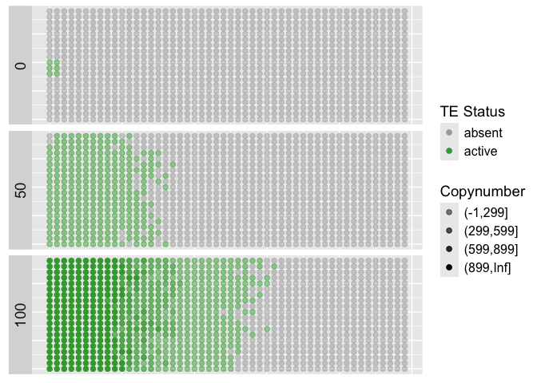
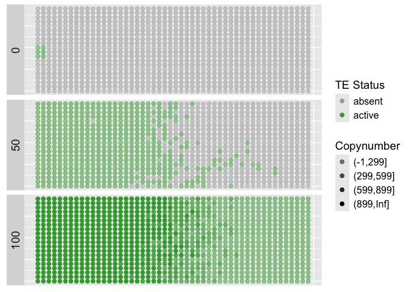
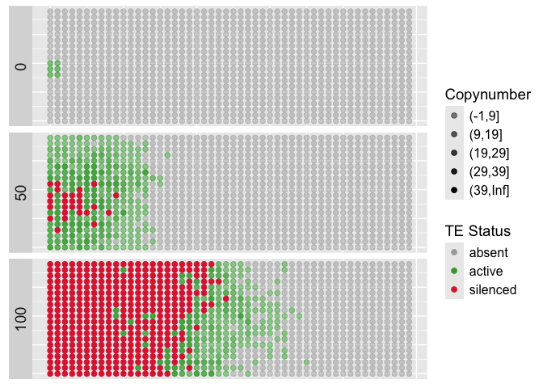
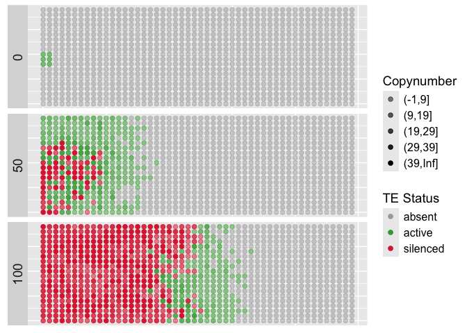
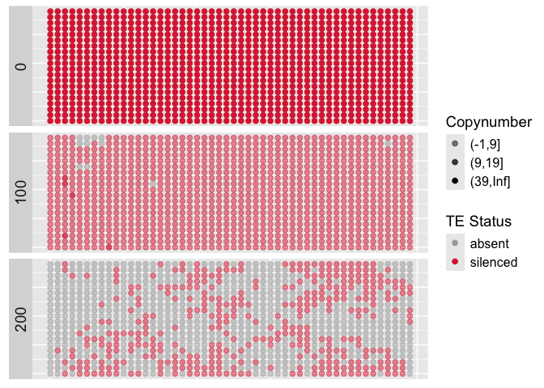
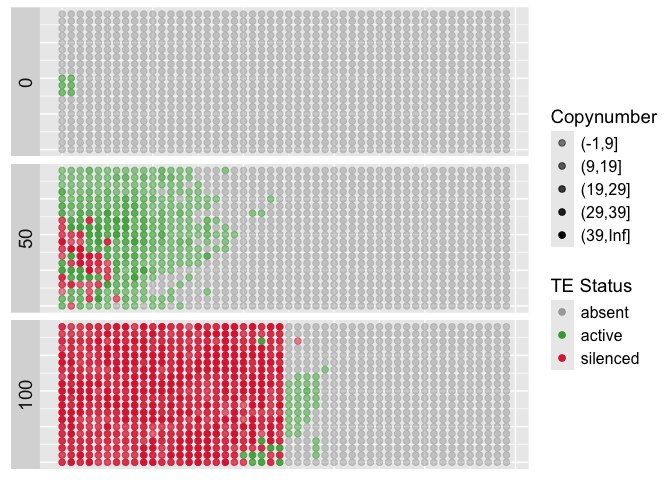

simple simulation scenarios
================

# Simplest simulation - TE invasion without host defence

## no host defence - mate radius 1

``` bash
# simulation code
./invade --seed 5 --genome MB:1,1 --rr 4,4 --u 0.1 --grid-x 50 --grid-y 20 --mate-radius 1 --epi-inherit none --basepop 9-11,1-2,10 --rep 1 --steps 5 --gen 100 --file-spatial simple.txt 
```

**parameters explained**

- –seed 5: the random seed
- –genome MB:1,1: a genome of 2 chromosomes each with a length of 1MB; a
  TE insertion may occupy any site in this genome of 2MB; novel
  insertions will get random positions in the genome; if a site is
  already occupied the novel insertion will be ignroed
- –rr 4,4: a recombination rate of 4cM/Mb per chromosome
- –u 0.1: the transposition rate is u=0.1; the number of novel
  insertions per gamete is poisson distributed with lambda = cu/2, where
  c is the total number of insertions in the genome of the parent. why
  divided by two? because we have to assume that novel insertions may
  occur in any of the two genomes of a diploid
- –grid-x 50: the x-size of the 2D grid is 50
- –grid-y 20: the y-size of the 2D grid is 20
- –mate-radius 1: the mate radius is 1; i.e. when generating the next
  generation, every individual in the spatial grid is replaced by a new
  individual the potential mates yielding the two gametes for the novel
  individual will be found in a radius of 1 of the focal individual.
  e.g. if the focal individual has y-x coordinates 3-3, then the
  potential mates may have coordinates 2-2, 2-3, 2-4, 3-2, 3-3, 3-4,
  4-2, 4-3, 4-4; note that the focal species could, by chance, also be
  one of the two mates
- –epi-inherit none: so far we assume no epigenetic inheritance of the
  TE silencing (more importantly so far we assume no host defense which
  would require providing the parameter `--trigger-threshold`, see
  below)
- –basepop 9-11,1-2,10: all individuals in the y-range 9-11 and the
  x-range 1-2 will have exactly 10 TE insertions; the insertions will be
  randomly distributed in the genome (of 2Mb). Hence every TE insertion
  will have a population frequency of 1/2N where N is the population
  size (N=`--grid-x` \* `--grid-y`)
- –rep 1: we simulate a single replicate
- –steps 5: output will be generated all 5 generations; note that we
  perform additional filtering in R, hence the final figures in this
  tutorial do not show the results for all 20 time points for which we
  generated an output –gen 100: simulations will be performed for 100
  generations –file-spatial simple.txt: the output file for generating
  the figure seen below

<!-- -->

**Note** the TE starts spreading at the small rectangular patch at
generation 1 defined by `--basepop 9-11,1-2,10`; The TE is invading the
population unconstrained by any host defense (therefore only green
dots). Due to the absence of a host defense very high TE copy numbers
per individual are reached by generation 100 (some have more than 900
insertions per diploid individual).

## no host defence - mate radius 2

``` bash
./invade --seed 5 --genome MB:1,1 --rr 4,4 --u 0.1 --grid-x 50 --grid-y 20 --mate-radius 2 --epi-inherit none --basepop 9-11,1-2,10 --rep 1 --steps 5 --gen 100 --file-spatial simple-mr2.txt 
```

**novel parameters explained**

- –mate-radius 2: compared to the previous example we extend the mate
  radius to two, hence potential mates can now be found more distantly
  of the focal species. E.g. if the focal species has y-x coordinates of
  3-3, than potential mates may for example have the coordinates 1-1,
  1-5, 5-5, 3-3 etc

<!-- -->

**Note** with a larger mate radius the TE spreads faster

## no host defence - mate radius ‘panmictic’

``` bash
./invade --seed 5 --genome MB:1,1 --rr 4,4 --u 0.1 --grid-x 50 --grid-y 20 --mate-radius pan --epi-inherit none --basepop 9-11,1-2,10 --rep 1 --steps 5 --gen 100 --file-spatial simple-pan.txt
```

**novel parameters explained**

- –mate-radius pan: panmictic simulations will be performed where the
  spatial coordinates are ignored. Hence everyone may mate with
  everyone; This can be quite useful. First we can test the simulator
  against theoretical population genetics models (that typically assume
  panmixis). Second we can evaluate the impact of spatial information on
  the invasion dynamics compared to panmixis.

<!-- -->

**Note** Every individual still has spatial coordinates during the
panmictic simulations. However, the coordinates are ignored for finding
mates. Hence, the coordinates have **no** impact in the panmictic
simulations. As a result the TE spreads quite stochastically in the
spatial grid.

# Host defence

## host defence - no epigenetic inherited silencing

``` bash
./invade --seed 5 --genome MB:1,1 --rr 4,4 --u 0.1 --grid-x 50 --grid-y 20 --mate-radius 1 --epi-inherit none --basepop 9-11,1-2,10 --rep 1 --steps 5 --gen 100 --trigger-defense 40 --file-spatial simple-defence.txt
```

**novel parameters explained**

- –trigger-defense 40: **simulations with host defense** the host
  defense will be triggered in any individual having 40 or more TE
  copies. In individuals with a host defense the TE will have a
  transposition rate of `--uc` which is 0.0 by default (i.e. no
  activity).

<!-- -->

**Note** The TE starts spreading at a small patch by generation 1. By
generation 50 already several individuals have triggered the host
defense. By generation 100, both the TE and the host defence is
spreading. **important** We did not simulate epigenetic inheritance of
the host defense in this scenario, therefore only individuals with 40 or
more TE copies can have the silenced TEs! (de novo triggered host
defense).

## host defence - uniparental epigenetic silencing inheritance

``` bash
./invade --seed 5 --genome MB:1,1 --rr 4,4 --u 0.1 --grid-x 50 --grid-y 20 --mate-radius 1 --epi-inherit dros --basepop 9-11,1-2,10 --rep 1 --steps 5 --gen 100 --trigger-defense 40 --file-spatial simple-defence-dros.txt 
```

**novel parameters explained**

- –epi-inherit dros: uniparental inherited silencing of the host
  defense; silencing is transmitted maternally as in Drosophila. Since
  hermaphrodites are simulated one mate is randomly chosen as the
  mother; If a TE is silenced in the mother any offspring with at least
  one TE insertion will inherit the epigenetic silencing status. The
  epigenetically inherited silencing status **can be lost only in
  offspring not having a single TE insertion** (due to chance offspring
  may not get a TE, especially when TE copy numbers are low); Fathers do
  not transmit the silencing status. TEs silenced in the father, will
  thus be active in the offspring (unless the mother has silenced TEs).

<!-- -->

**Note** As the major difference to the previous scenario
(`--epi-inherit dros`), even individuals with less than 40 TEs may have
silenced TEs.

## host defence - biparental epigenetic silencing inheritance

``` bash
./invade --seed 5 --genome MB:1,1 --rr 4,4 --u 0.1 --grid-x 50 --grid-y 20 --mate-radius 1 --epi-inherit ara --basepop 9-11,1-2,10 --rep 1 --steps 5 --gen 100 --trigger-defense 40 --file-spatial simple-defence-ara.txt 
```

**novel parameters explained**

- –epi-inherit ara: biparental inherited silencing of the host defence;
  if a TE is silenced in any parent, the TE will be silenced in the
  offspring (even if the TE is still active in one of the parents). This
  means that the silencing will spread with all gametes. The silencing
  will thus spread like the a very effective genetic drive.

<!-- -->

**Note** The epigenetic silencing is spreading very fast (as expected
for an efficient drive system). In fact the silencing is spreading
faster than the TE. Hence by generation 100 the TE is silenced in all
individuals. A patchy TE distribution is thus observed.

## host defence - biparental epigenetic silencing and selfing

``` bash
./invade --seed 5 --genome MB:1,1 --rr 4,4 --u 0.1 --grid-x 50 --grid-y 20 --mate-radius 1 --epi-inherit ara --basepop 9-11,1-2,10 --rep 1 --steps 5 --gen 100 --trigger-defense 40 --selfing-rate 0.95 --condinv --file-spatial simple-defence-ara-self.txt 
```

**novel parameters explained**

- –selfing-rate 0.95: Now we include selfing in the simulations, we use
  a selfing rate of 95%. There is thus a 95% chance that the mother and
  the father will be identical individuals. An andidivual is thus
  generting two gametes (with recombination and transposition) that will
  form the novel diploid organism. Selfing is thus not identical to
  cloning.
- –condinv: conditional on invasion; this is a convenience method; TE
  invasions frequently fail in selfing populations; to simulate a
  successful invasion it would thus be necessary to try many different
  seeds. With this option simulations are performed until the required
  number of simulations was successful (`--rep`).

<!-- -->

**Note** With selfing and biparental inheritance TEs are silenced very
quickly and thus only have a limited capacity to spread in the spatial
population.

# Negative selection against inactive TEs

## negative selection - biparental inheritance

``` bash
./invade --seed 5 --genome MB:1,1 --rr 4,4 --u 0.1 --grid-x 50 --grid-y 20 --mate-radius 1 --epi-inherit ara --basepop "1-20,1-50,40'" --rep 1 --steps 5 --gen 400 --trigger-defense 40 --s 0.1 --h 0.5 --file-spatial simple-negsel-ara.txt
```

**novel parameters explained**

- –s 0.1: selection coefficient against homozygous insertions, fitness
  of homozygous individuals is w=1-s

- –h 0.5: heterozygous effect; , fitness of heterozygous individuals is
  is w=1-hs; this allows to specifiy additive (h=0.5), recessive (h=0.0)
  and dominant (h=1.0) TE insertions.

- –basepop “1-20,1-50,40’”: all individuals in the entire population
  (y-range 1-20 and x-range 1-50) will have 40 **silenced** TE
  insertions (the dash indicates that the TE is silenced). **Note** that
  TE insertions will largely be segregating at different genomic sites
  (unless individuals have by chance the same insertion site in our 2Mb
  genome).

<!-- -->

**Note** selection against TEs may lead to a patchy distribution **when
TEs are silenced biparental**. Importantly in this scenario we assumed
i) that the TE family was present in all ancestors of the extant
population and ii) that the TE was silenced in the ancestors and iii)
biparental inheritance of the silencing.

## negative selection - uniparental inheritance

``` bash
./invade --seed 5 --genome MB:1,1 --rr 4,4 --u 0.1 --grid-x 50 --grid-y 20 --mate-radius 1 --epi-inherit dros --basepop "1-20,1-50,40'" --rep 1 --steps 5 --gen 400 --trigger-defense 40 --s 0.1 --h 0.5 --file-spatial simple-negsel-dros.txt 
```

**novel parameters explained**

There are no novel parameters in this scenario, solely a novel
combination of parameters, i.e. selection against TEs combined with
uniparental inheritance `--epi-inherit dros`. We again assumed that the
TE is present and silenced in all ancestors of the extant population.

<!-- -->

**Now this is a surprise to me! Negative selection against TEs combined
with uniparental silencing does not lead to patchyness** Actually TEs
are reactivated in almost all individuals in this scenario, although the
TE was silenced in all individuals of the base population! Thats quite
fascinating, but makes sense. In this scenario the silencing can be lost
as soon as negative selection reduced the load of TEs to such an extend
that some individuals end up with zero TEs. Now the TE can be
reactivated in crosses with mothers not having the TE and fathers having
the TE (fathers transmit the TE but not the silencing).

# Population structure - uniparental inheritance

``` bash
./invade --seed 5 --genome MB:1,1 --rr 4,4 --u 0.1 --grid-x 50 --grid-y 20 --mate-radius 1 --epi-inherit dros --basepop 9-11,1-2,10 --rep 1 --steps 5 --gen 100 --trigger-defense 40 --mate-barrier 25 --barrier-strength 0.99 --file-spatial simple-matebar.txt 
```

**parameters explained**

- –mate-barrier 25: position of mating barrier in the X-grid; Mating
  will be less likely for individuals at opposite ends of the
  mating-barrier. In this example individuals with x-coordinates 25 and
  26 will rarely mate. Note that several mating barriers can be provided
  e.g. `--mate-barrier 10,20,30,40` would introduce several mate
  barriers at steps of 10 in the x-grid.
- –barrier-strength 0.99: a 99% reduction in mating-probabilty for
  individuals on opposite ends of the mating-barrier.

<!-- -->

**Note** the coordinates of the mate barrier (x-position 25) can be
clearly discerned at generation 100; Also note that most individuals in
the left deme have about 40 TE copies (i.e. the silencing threshold),
whereas most individuals in the right deme have very few insertions or
no insertion.
