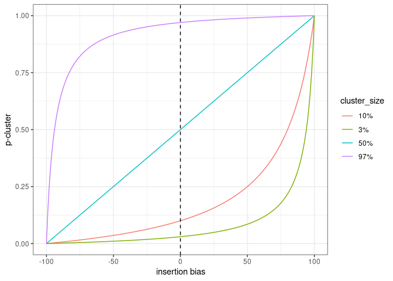

insertionbias
================
2023-01-25

# Insertionbias intro

We are simulating an insertion bias into piRNA clusters. The bias may go
from -100% to 100%

- -100%: complete bias against piRNA clusters; no TE will ever jump into
  a cluster
- +100% complete bias towards piRNA clusters; all TEs will jump into a
  piRNA cluster
- 0% no bias; the probabiltiy to jump into a piRNA cluster is bascially
  the total size of the cluster (as fraction)

But how to model this with some mathematical equation? My idea is
actually based on the equations used for computing the allele frequency
of selected allele.

Here is the implementation in R

- pc: probability for a cluster insertion; computes the probability that
  a TE will jump into a piRNA cluster, give some insertion bias (bias)
  and some total size of the piRNA clusters (clufrac)
- bias: insertion bias of the TE; from -100 to +100
- clufrac: total size of the piRNA clusters in percent of genome; eg in
  Drosophila piRNA clusters account for 3% of the genome

``` r
pc <- function(bias,clufrac){
genfrac<- 1.0-clufrac
bias <- bias/100
clufit <- (bias+1.0)/2.0
genfit <- 1.0 - clufit
totfit <- clufrac*clufit + genfrac*genfit
p<-(clufrac*clufit)/totfit
}
```

## Visualize the insertion bias

The following curve shows how the insertion bias (ranging from -100 to
100) is translated into the probability that a TE will jump into a piRNA
cluster (p-cluster: ranging from 0 to 1). In the case of **NO** bias the
insertion probability is equal to the total size of the cluster (dashed
line). The following curve shows the results for four different sizes of
piRNA-clusters. Note that a realistic scenario, for example in
Drosophila, corresponds to **3%**. Further note that this is going to be
implemented as unit-test ensuring the correct implementation of the
insertion bias in the Go software.

``` r
library(ggplot2)
theme_set(theme_bw())
p3<-pc(-100:100,0.03)
p10<-pc(-100:100,0.1)
p50<-pc(-100:100,0.5)
p97<-pc(-100:100,0.97)
df<-data.frame(bias=rep(-100:100,4),insprob=c(p3,p10,p50,p97),cluster_size=c(rep("3%",201),rep("10%",201),rep("50%",201),rep("97%",201)))

g<-ggplot(df,aes(x=bias,y=insprob,col=cluster_size))+geom_line()+xlab("insertion bias")+ylab("p-cluster")+
geom_vline(xintercept = 0, linetype="dashed")
plot(g)
```

<!-- -->
